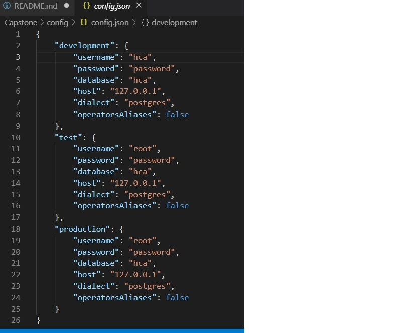

# MEAN_Final_Project
- This is a MEAN project using Express, PostgreSQL, Angular, Angular Materials and ORM tool Sequelize.
- To display list of site users, register and delete the users.
- To display teams and leagues.

## Site Pages
- Home page
- Login page
- Registration page
- Edit User Profile Page
- Teams Page 

## Technical Instructions
1. Clone the repo on your computer.
2. Goto the copied folder in command navigate to server folder run following commands
    -  $ npm install 
    -  $ npm run dev    
    -  Server runs at http://localhost:3000

3. Open another instance of command prompt and navigate to client folder run following commands
    - $ npm insall
    - $ ng serve
    - Open chrome browser goto http://localhost:4200    
    - Client runs at http://localhost:4200

## Postgres Setup - Tables Creation
1. In command terminal goto folder server run following sequelize command
    - $ sequlize db:migrate

## Data Loading
1.  In command terminal goto folder server/seeders and run follwoing 
    - $ node seed

## Additional Developer Information
- The application is developed using Express generator, Angular and the Postgres database utilizing ORM sequelize tool. follwoing are useful instructions for developers to setup the running application code.

### Install Modules
+ $ npm install express-generator -g

### Express Generator 
+ $ cd A_WORKING_DIR_OF_YOUR_CHOIDE
+ $ express --view=hbs capstone
+ npm install express hbs body-parser morgan nodemon --save

### Sequelize Setup
+ First part, as we have already installed postgres dependencies pg and pg-hstore
+ Second, We going to make use of Sequelize CLI package to bootstrap the project. it will also generate the database migration. let's install Sequelize.

$ npm install -g sequelize-cli

### Install sequelize

+ At this point, we are going to need to install the actual Sequelize package, alongside its dependencies along with postgres.

$ npm install --save sequelize

$ npm install --save pg pg-hstore 

### Initializes sequelize

After installation, let use the CLI to generate migrations, seeders, config and models directories and config file

$ sequelize init // final, Initializes project with sequelize cil

if you examing the directory stucture now, you will realise the about command created the boilerplate code. the directory stucture should now look like this now.

MEAN_FINAL_Project
── app.js

├── package.json

├── config

│   └── config.json

├── migrations

├── models

│   └── index.js

└── seeders

### Database Configurations

Change the config.json which is located at config\config.json and modify the dabase details.

### Generating Model & Migrations

lets now use sequeize CLI to generate model and migration files

The models that we will be grneating are users, leagues and teams.

Run the following command 

### Creating User Model
$ sequelize model:create --name USERS --attributes USER_NAME:string,FIRST_NAME:string,LAST_NAME:string,PASSWORD:string,EMAIL:string,IS_ADMIN:boolean

### Creating LEGUES Model
$ sequelize model:create --name LEAGUES --attributes NAME:string,CODE:string,DESCRIPTION:string

### Creating TEAMS Model
$ sequelize model:create --name TEAMS --attributes TEAM_NAME:string,LEAGUE_ID:number,MAX_TEAM_MEMBERS:number,MIN_AGE:number,MAX_AGE:number,TEAM_GENDER:string,MANAGER_NAME:string,MANAGER_PHONE:string,MANAGER_EMAIL:string